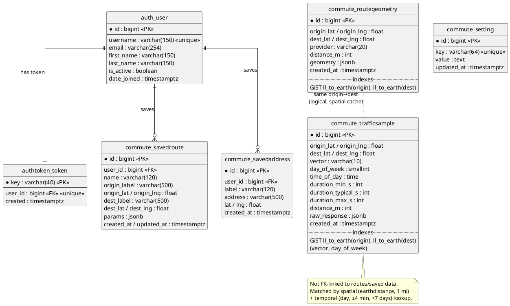
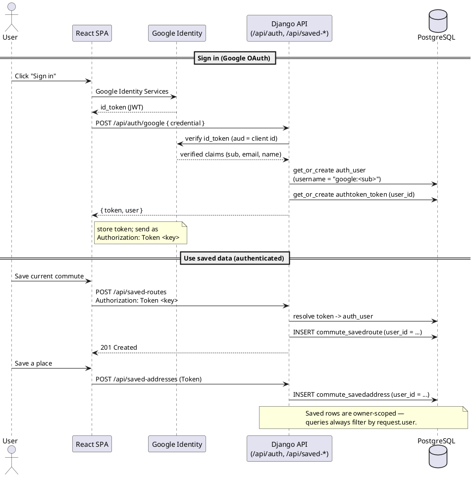
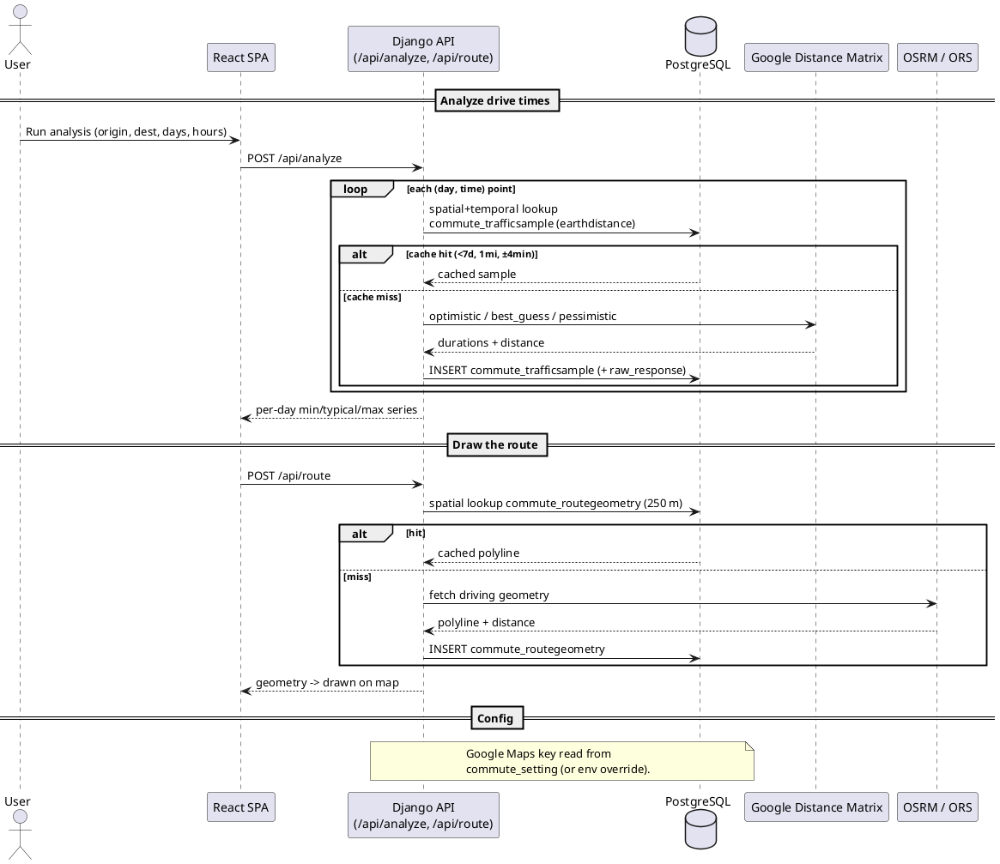

# Database schema

Reference for the Traffinator PostgreSQL schema: every table, its columns, and
the relationships between them, with PlantUML diagrams for the **commute** and
**authentication** domains (relationships + usage).

PlantUML blocks render in any PlantUML viewer (the homelab runs one at
`apps/plantuml`); paste the `@startuml…@enduml` blocks, or use a Markdown
preview with PlantUML support.

Table names use Django's `<app>_<model>` convention. The schema splits into
three groups:

- **Commute domain** (`commute_*`) — the analytics cache and app config.
- **Authentication** (`auth_user`, `authtoken_token`, and the user-owned
  `commute_saved*`) — who a user is and what they saved.
- **Django framework** plumbing (`auth_*`, `django_*`) — standard, rarely
  touched directly.

---

## Table catalog

| Table | Group | Purpose |
|---|---|---|
| `commute_trafficsample` | Commute | Cached predictive drive-time measurements (the analytical array). |
| `commute_routegeometry` | Commute | Cached driving-route polylines for the map. |
| `commute_setting` | Commute | App key/value config (e.g. the Google Maps API key). |
| `commute_savedroute` | Auth/user data | A user's saved commute (endpoints + analysis params). |
| `commute_savedaddress` | Auth/user data | A user's saved place (home/work/gym). |
| `auth_user` | Auth | User accounts (created on Google sign-in). |
| `authtoken_token` | Auth | DRF API token, one per user. |
| `auth_permission`, `auth_group`, `auth_group_permissions`, `auth_user_groups`, `auth_user_user_permissions` | Framework | Django's permission/group system (unused by the app logic, present from `django.contrib.auth`). |
| `django_content_type` | Framework | Model registry used by permissions. |
| `django_migrations` | Framework | Applied-migration ledger. |

> Not present: `django_session` and `django_admin_log` — the app uses token auth
> (no sessions) and doesn't enable the Django admin.

---

## Commute domain

### `commute_trafficsample`
One cached predictive measurement for a single (origin, destination, vector,
day-of-week, time-of-day) point. Min/typical/max come from Google's
optimistic / best_guess / pessimistic traffic models.

| Column | Type | Null | Description |
|---|---|---|---|
| `id` | bigint PK | no | Surrogate key. |
| `origin_lat` | double precision | no | Origin latitude (degrees). |
| `origin_lng` | double precision | no | Origin longitude (degrees). |
| `dest_lat` | double precision | no | Destination latitude. |
| `dest_lng` | double precision | no | Destination longitude. |
| `vector` | varchar(10) | no | `departure` (leave at) or `arrival` (arrive by). |
| `day_of_week` | smallint | no | 0 = Monday … 6 = Sunday. |
| `time_of_day` | time | no | Local clock time of the point (e.g. 08:15). |
| `duration_min_s` | integer | no | Optimistic drive time, seconds. |
| `duration_typical_s` | integer | no | Best-guess (typical) drive time, seconds. |
| `duration_max_s` | integer | no | Pessimistic drive time, seconds. |
| `distance_m` | integer | yes | Route distance in meters (best-guess call). |
| `raw_response` | jsonb | no | Full Google payloads + queried/target times, for audit/debug. |
| `created_at` | timestamptz | no | Insert time; drives the 7-day cache expiry. |

**Indexes:** PK; btree on `created_at`; composite btree on (`vector`,
`day_of_week`); **GiST** on `ll_to_earth(origin_lat, origin_lng)` and
`ll_to_earth(dest_lat, dest_lng)` for the 1-mile spatial cache lookup
(earthdistance).

### `commute_routegeometry`
Cached driving-route geometry (the road path drawn on the map), as an ordered
list of `[lat, lng]` points. Cached spatially so near-identical requests reuse
the polyline; the stored geometry can also seed future corridor/overlap analysis.

| Column | Type | Null | Description |
|---|---|---|---|
| `id` | bigint PK | no | Surrogate key. |
| `origin_lat` | double precision | no | Origin latitude. |
| `origin_lng` | double precision | no | Origin longitude. |
| `dest_lat` | double precision | no | Destination latitude. |
| `dest_lng` | double precision | no | Destination longitude. |
| `provider` | varchar(20) | no | Routing source: `osrm` or `openrouteservice`. |
| `distance_m` | integer | yes | Driving distance in meters. |
| `geometry` | jsonb | no | Ordered `[[lat, lng], …]` polyline points. |
| `created_at` | timestamptz | no | Insert time; 30-day cache TTL. |

**Indexes:** PK; btree on `created_at`; **GiST** on `ll_to_earth` of origin and
destination (250 m spatial cache radius).

### `commute_setting`
App-level key/value config. The Google Maps API key entered on the setup screen
lives here (an `GOOGLE_MAPS_API_KEY` env var always takes precedence).

| Column | Type | Null | Description |
|---|---|---|---|
| `id` | bigint PK | no | Surrogate key. |
| `key` | varchar(64) | no | Setting name, **unique** (e.g. `google_maps_api_key`). |
| `value` | text | no | Setting value. |
| `updated_at` | timestamptz | no | Last-write time. |

---

## Authentication & user data

### `auth_user` (Django)
User accounts. Created on first Google sign-in via `get_or_create` with
`username = "google:<google-subject-id>"`; the password is unusable (login is
OAuth-only), `email`/names come from the verified Google profile.

| Column | Type | Null | Description |
|---|---|---|---|
| `id` | bigint PK | no | Surrogate key; referenced by saved data and token. |
| `password` | varchar(128) | no | Django password hash — **unusable** here (OAuth only). |
| `last_login` | timestamptz | yes | Last login time (set by Django). |
| `is_superuser` | boolean | no | Always false for app users. |
| `username` | varchar(150) | no | **Unique**; `google:` — stable Google subject id. |
| `first_name` | varchar(150) | no | From Google `given_name`. |
| `last_name` | varchar(150) | no | From Google `family_name`. |
| `email` | varchar(254) | no | Verified Google email. |
| `is_staff` | boolean | no | False (admin not used). |
| `is_active` | boolean | no | True for active accounts. |
| `date_joined` | timestamptz | no | Account creation time. |

### `authtoken_token` (DRF)
One API token per user. Issued on login, sent by the SPA as
`Authorization: Token <key>` on saved-data requests.

| Column | Type | Null | Description |
|---|---|---|---|
| `key` | varchar(40) | no | **Primary key** — the bearer token string. |
| `user_id` | bigint | no | **FK → `auth_user.id`, unique** (one token per user). |
| `created` | timestamptz | no | Token issue time. |

### `commute_savedroute`
A user's saved commute: both endpoints plus the analysis parameters, so it
restores the whole form in one click.

| Column | Type | Null | Description |
|---|---|---|---|
| `id` | bigint PK | no | Surrogate key. |
| `user_id` | bigint | no | **FK → `auth_user.id`** (CASCADE delete). Owner. |
| `name` | varchar(120) | no | User-chosen label (e.g. "Morning commute"). |
| `origin_label` | varchar(500) | no | Human-readable origin (address text). |
| `origin_lat` | double precision | no | Origin latitude. |
| `origin_lng` | double precision | no | Origin longitude. |
| `dest_label` | varchar(500) | no | Human-readable destination. |
| `dest_lat` | double precision | no | Destination latitude. |
| `dest_lng` | double precision | no | Destination longitude. |
| `params` | jsonb | no | Saved form: `vector`, hours, interval, `days`, `palette`. |
| `created_at` | timestamptz | no | Creation time. |
| `updated_at` | timestamptz | no | Last-update time (default ordering, newest first). |

### `commute_savedaddress`
A user's saved place, droppable into the From/To fields.

| Column | Type | Null | Description |
|---|---|---|---|
| `id` | bigint PK | no | Surrogate key. |
| `user_id` | bigint | no | **FK → `auth_user.id`** (CASCADE delete). Owner. |
| `label` | varchar(120) | no | Short name (e.g. "Home"); default ordering. |
| `address` | varchar(500) | no | Full geocoded address text. |
| `lat` | double precision | no | Latitude. |
| `lng` | double precision | no | Longitude. |
| `created_at` | timestamptz | no | Creation time. |

---

## Relationships

**Foreign keys (enforced):**
- `authtoken_token.user_id` → `auth_user.id` — **one-to-one**.
- `commute_savedroute.user_id` → `auth_user.id` — **many-to-one** (CASCADE).
- `commute_savedaddress.user_id` → `auth_user.id` — **many-to-one** (CASCADE).
- Framework: `auth_user_groups`, `auth_user_user_permissions`,
  `auth_group_permissions`, and `auth_permission.content_type_id` wire up
  Django's permission system (unused by app logic).

**Logical (not FK-enforced) relationships:** `commute_trafficsample`,
`commute_routegeometry`, and the coordinates embedded in `commute_savedroute`
all describe an origin→destination pair, but they are **deliberately not
FK-linked**. Lookups are **spatial+temporal** (earthdistance radius + day/time
window), not key joins — so a new request reuses any nearby cached row rather
than matching an exact id. This is the core caching design; see
[runbooks/postgres-operations.md](runbooks/postgres-operations.md).

---

## Diagram — entity relationships (ERD)

---

## Diagram — authentication: relationships & usage

How sign-in produces a user + token, and how the token gates saved data.

---

## Diagram — commute analysis: relationships & usage

How the analyze/route flows read and fill the cache tables.

---

## Notes

- **Spatial indexes (earthdistance):** the GiST `ll_to_earth(...)` indexes on
  `commute_trafficsample` and `commute_routegeometry` make the radius lookups
  index-assisted; see the migrations and the operations runbook.
- **JSONB columns:** `raw_response`, `geometry`, and `params` are `jsonb` — query
  with `->`/`->>`, and flatten on CSV export (see
  [runbooks/postgres-csv-export.md](runbooks/postgres-csv-export.md)).
- **Cascade deletes:** deleting an `auth_user` removes its `authtoken_token`,
  `commute_savedroute`, and `commute_savedaddress` rows. Cache/config tables are
  independent of users.
